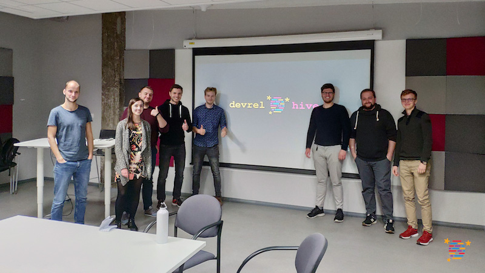
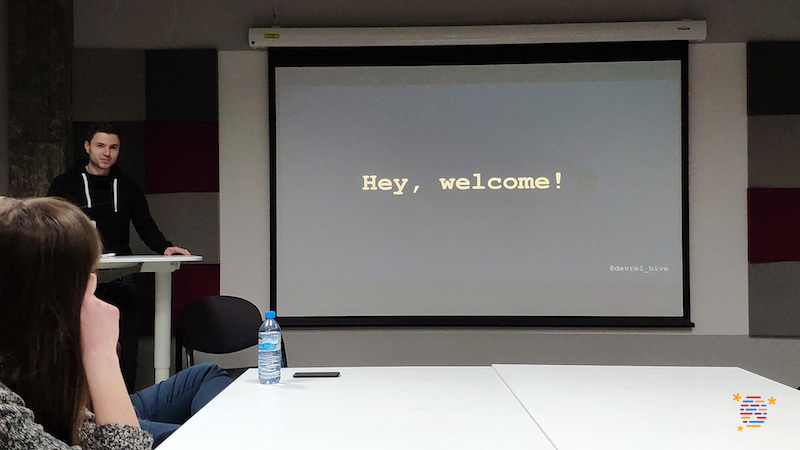
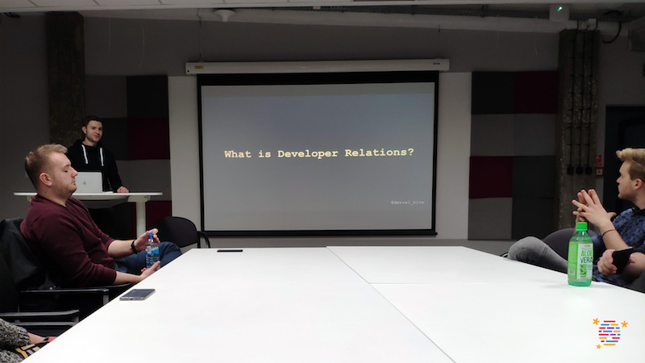

# devrel hive #1 : Developer Relations, Cracow, 26.03.2019

* When: **26.03.2019**
* Where: **hub:raum Cracow, Przemyslowa 12**
* Attendance: **8 community members** 

Our main goal was to form up the new Developer Relations community in Poland and CEE. We kicked it off with:

* A community introduction
* A talk about "What is Developer Relations?" by @abiela
* A community discussion about the upcoming community goals

## Community introduction

We started from a warm welcome to all community members that already joined us during the first meeting.

We focus on our core values defined in the Code of Conduct:
https://github.com/devrelHive/devrelHive/blob/master/code-of-conduct.md

## Talk #1: What is Developer Relations?

Arek gave an overview talk about what is Developer Relations. Understanding the real value behind it was an opening point. Then, we went through DevRel roles such as Developer Evangelism, Developer Advocacy or Developer Experience and it's the main area of interests and actions. Activities like hackathons, events, workshops or social media engagements were described.

## Community discussion

Discovering potential upcoming topics for the next months and meetups was the key point of the discussion.

We identified key growth paths to be covered:

1. **First steps with Developer-first strategy** - We want to have a better grasp of first steps & challenges when implementing developer-oriented strategy into the product. Lessons learned based on a real, product case might bring in high-quality knowledge value.

2. **Proper communication with business & developers** - One of the most important DevRel skills is communication part. Our aim is to improve our soft skills to be able to both dealing with networking with developers as well as explaining and overcommunicating DevRel team effort outcomes to the business part of your product.

3. **Implementing open-source product strategy** - Open-source strategy becomes more and more popular in current product management.  What's the real value behind that? How does it impact on relations with the developer community? What can be open-sourced and why?

4. **The value of documentation** - Well-prepared documentation for API,SDK or a software tool might make a crucial difference in first developer experience. Yet, everything depends on the documentation target group. We want to learn about good practices and tools for making great docs.